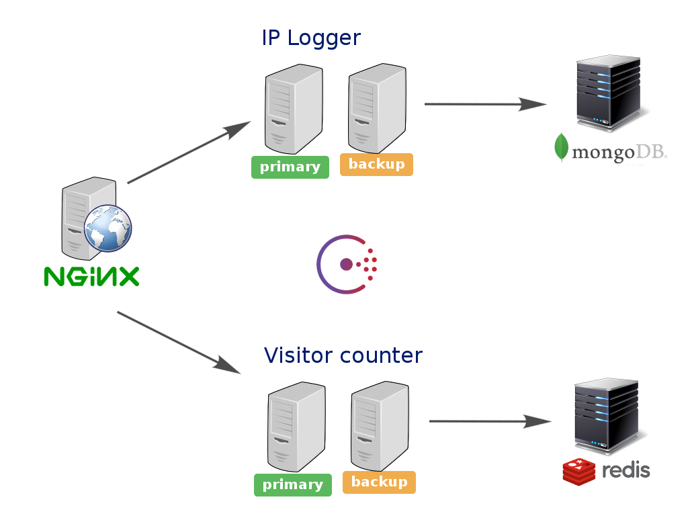

# Continuous Deployment with Docker

## Description

This project shows a web application built using a microservices architecture.

There are two python microservices (rest-count and rest-ip).

Using consul-template you can generate a dynamic Nginx configuration so that you can deploy new microservices version with no downtime.

You can find additional information on my [Slideshare presentation "Always be shipping"](http://www.slideshare.net/francescou/always-be-shipping)



## Prerequisites

Docker 1.8.3

docker-compose 1.4.2

## Getting started

Run the following commands in terminal (the first time you have to wait for a few minutes to download the Docker base images):

```
docker build -t rest-count rest-count/

docker build -t rest-ip rest-ip/

docker-compose -f application/docker-compose.yml up -d 
```

open your browser to http://localhost:8080/

you can check the Consul state on http://localhost:8500/ui/

now edit rest-count/main.py (for example, you can increase the version to 1.1)

```
docker build -t rest-count rest-count/

docker-compose -f application/docker-compose.yml up -d restcountprimary

sleep 15

docker-compose -f application/docker-compose.yml up -d restcountbackup
```

